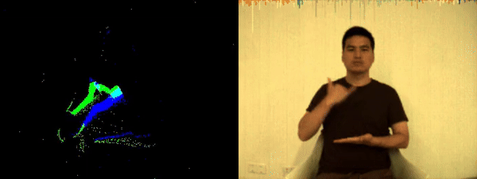

# DVS-SLR Benchmark Dataset

## Introduction
The DVS-SLR dataset is a dual-modal neuromorphic dataset designed to address the limitations of existing neuromorphic datasets and to promote the development of Spiking Neural Network (SNN) oriented technologies. With a focus on action recognition, this dataset is crafted to fully exploit the spatio-temporal capabilities of SNNs and to facilitate research into SNN-based fusion methods.


## Dataset Features
- **Large-Scale**: Comprising 5,418 samples recorded by 43 subjects, each lasting about 6 seconds, the dataset provides over 9 hours of recording.
- **Multi-Illumination**: Recorded under three different lighting conditions (bright LED light, dim LED light, and natural light), enhancing the diversity and challenging the robustness of models.
- **Multiple Positions**: Data recorded from different distances (front and back positions) provide varied event rates and spatial distributions.
- **Dual-Modality**: Utilizing the DAVIS346 camera, the dataset includes both event streams and frame streams.

## Dataset Usage Guide

Here's how to use The `DVS346Sign` class:


### Importing the Dataset Class
Ensure you have the necessary libraries and the `DVS346Sign` class file in your working directory. Import the class using:
```python
from dataset import DVS346Sign
```

### Initializing the Dataset
Create an instance of the `DVS346Sign` class by specifying the path to your dataset, the subsets of users, labels, lighting conditions, and positions you want to include:
```python
root_dir = 'path_to_your_dataset'
users = ['user'+str(i) for i in range(43)]
labels = ['at','drink','eat','everybody','go','home','i','jump','listen','rest','run','school','see','shower','sleep','study','talk','want','washhands','you','other']
lights = ['brightLED', 'dimLED', 'naturalLight']
positions = ['front', 'back']
dataset = DVS346Sign(root_dir, users, labels, lights, positions)
```

### Accessing Data
The dataset can be accessed like any standard PyTorch dataset:
```python
from torch.utils.data.dataloader import DataLoader

# Initialize DataLoader
data_loader = DataLoader(dataset, batch_size=2, shuffle=True)

# Iterate through the data
for data, label in data_loader:
    (spike_frames, rgb_frames) = data
    # Add your Processing code here
    # torch.Size([2, 120, 2, 260, 346]) torch.Size([2, 120, 3, 260, 346]) tensor([6, 3])
    print(spike_frames.shape, rgb_frames.shape, label)
```

### Detailed Description of Methods
- **`temporal_sample(frames)`**: Samples frames based on a defined temporal interval `dt` to align with the temporal resolution of event data.
- **`pad_frames(spike_frames, rgb_frames, length)`**: Ensures all data samples are of uniform length by padding shorter sequences with the last frame.
- **`generate_bimodal_synchronous_frame_stream(frames, events)`**: Generates synchronized spike and RGB frame streams from the raw event and frame data.
- **`align_frame(t_frame, imgs, t_event)`**: Aligns the frame timestamps with the events to ensure temporal synchronization.

### Requirements
- Python 3.x
- PyTorch
- NumPy
- `spikingjelly` library for event-based neural network implementations.

## Access and Additional Resources
The dataset, along with the data loading code and the source code of the CMA model, is available on our GitHub page and Google Drive.

- **GitHub Repository:** [https://github.com/JasonKitty/DVS-SLR](https://github.com/JasonKitty/DVS-SLR)
- **Data Access:** [[Google Drive](https://drive.google.com/file/d/1xcIIUmvdkZ2a1c0AMdtXpfafBIpuhiYO/view?usp=drive_link)]

## Citation
If you find our dataset or algorithms useful, please cite our paper:
```bibtex
@article{zhou2024enhancing,
  title={Enhancing SNN-based spatio-temporal learning: A benchmark dataset and Cross-Modality Attention model},
  author={Zhou, Shibo and Yang, Bo and Yuan, Mengwen and Jiang, Runhao and Yan, Rui and Pan, Gang and Tang, Huajin},
  journal={Neural Networks},
  pages={106677},
  year={2024},
  publisher={Elsevier}
}
```
