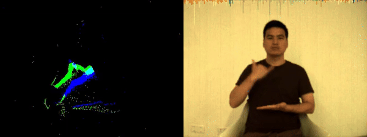

# DVS-SLR Benchmark Dataset

## Introduction
The DVS-SLR dataset is a dual-modal neuromorphic dataset designed to address the limitations of existing neuromorphic datasets and to promote the development of Spiking Neural Network (SNN) oriented technologies. With a focus on action recognition, this dataset is crafted to fully exploit the spatio-temporal capabilities of SNNs and to facilitate research into SNN-based fusion methods.

## Dataset Features
- **Large-Scale**: Comprising 5,418 samples recorded by 43 subjects, each lasting about 6 seconds, the dataset provides over 9 hours of recording.
- **Multi-Illumination**: Recorded under three different lighting conditions (bright LED light, dim LED light, and natural light), enhancing the diversity and challenging the robustness of models.
- **Multiple Positions**: Data recorded from different distances (front and back positions) provide varied event rates and spatial distributions.
- **Dual-Modality**: Utilizing the DAVIS346 camera, the dataset includes both event streams and frame streams.

## Access and Additional Resources
The dataset is available on Google Drive [Add a hyperlink here]. We also provide the data loading code and the source code of the CMA module.

**GitHub Repository:** [https://github.com/JasonKitty/DVS-SLR](https://github.com/JasonKitty/DVS-SLR)
